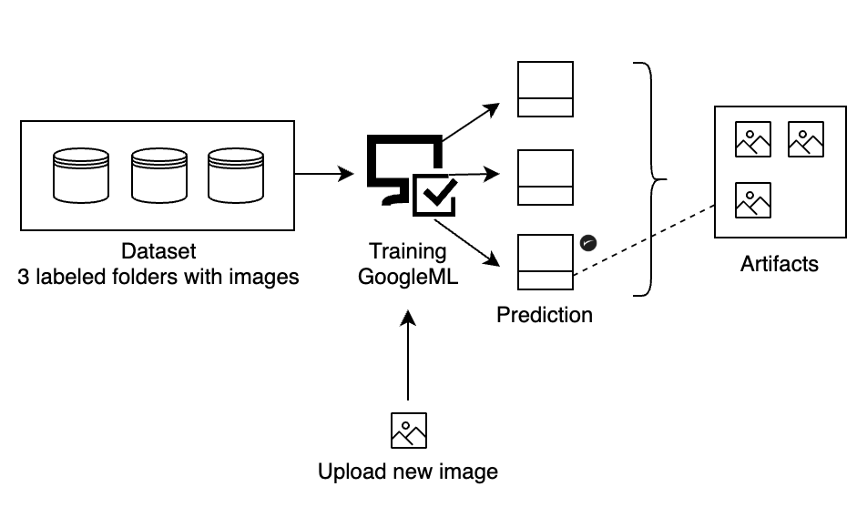
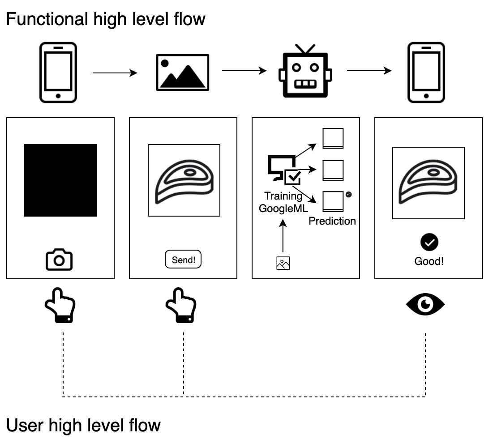

# AI Product Proposal: Food waste reduction in supermarkets

“Getting food to our table eats up 10 percent of the total US energy budget, uses 50 percent of US land and it swallows 80 percent of freshwater consumed in the United States” - NRDC: Waste – How America is Losing Up to 40 percent of its Food from Farm to Fork to Landfill

## Background

Statistics and numbers...
* Every year the US throws away 1/3 of all the food it produces: 133 billion pounds of food which represents USD 180 billions worth.
* Grocery stores and supermarkets toss 10% of the total waste: 13.3 billion
Main sources
* FAO.org (Food and Agriculture Organization of the United Nations)
* USDA.gov (United States Department of Agriculture)
* NRDC white paper: Waste – How America is Losing Up to 40 percent of its Food from Farm to Fork to
Landfill - https://www.nrdc.org/sites/default/files/wasted-food-IP.pdf

Other sources
* https://www.biologicaldiversity.org/programs/population_and_sustainability/grocery_waste/ • https://www.businessinsider.com/why-grocery-stores-throw-out-so-much-food-2014-10
* https://www.dumpsters.com/blog/grocery-store-food-waste-statistics

## Business Goal

### Project Overview and Goal

What is the industry problem you are trying to solve?
Why use ML/AI in solving this task? Be as specific as you can when describing how ML/AI can provide value. For example, if you’re labeling images, how will this help the business?

**Industry problem:**

Every year, supermarkets and groceries toss more than 13.3 billion pounds of food in “good state” (aka, totally suitable for human consumption).

Why is this happening...?

1. Overstock <> Product display
Supermarkets assemble big displays with the aim of capturing the user’s attention. This occurs particularly with on/off season products, produces and brands with high and/or low demand along with limited physical space, etc). The relation is proportional... They display both what they want to make trend (linked to pre- purchased batches) and what they want to cleanup stock (promotions).

TODO: Add image clean-up sales.
TODO: Add image seasonal offers.

2. Perfect appearance
Supermarkets sustain people want perfect looking produce (color, size) rejecting those that don’t meet the “aesthetic criteria”. Note: since “perfection” is subjective, there is no way to properly measure it, nor have a standard benchmark to empirically validate this statement across regions and cultures.

TODO: Add image ugly-produce.

3. Sell-by dates
Most foods are good long after their sell-by date. Even when sell-by is a guide of freshness (no expiration), supermarkets claim people don’t pick products close to or exceeding the sell-by label. More information about [Food Product Dating]( https://www.fsis.usda.gov/wps/portal/fsis/topics/food-safety-education/get-answers/food-safety-fact-sheets/food-labeling/food-product-dating/food-product-dating)

TODO: Add image Sell-By-Dates tag 

4. Packaging damage
In relation to the way supermarkets store and display products, either by human manipulation and/or the weight of the product’s pile/stack on a particular product, various produces have to be thrown away because the package is broken, and the produce exposed.

From the previous “4 consigned causes of waste”, I’m going to focus on “packaging damage” and limit its context to “meat trays condition”.
Usually, supermarkets pack this produce in-house, so that unlike other packed goods (like pasta), these are easy to re- package without having to go back to the production line and/or include third-party services providers.

*Quick note:* When we refer to meats we are talking about red meat, poultry and pork.

TODO: Add image meat trays.

**Small scope**

Use Image Annotation to determine the condition of the meat tray.

Possible labels: Good, Replace, Damaged, Not sure.

Our goal is to prevent damage to avoid, consequently, food waste.

As I stated before, either for “weight on” or “human manipulation” meat trays get damaged.
Between “good” and “bad state”, we can identify those trays that need to be re-packed before they are damaged.

We can consider as “damaged” those trays that expose the produce (any kind of hole in the packaging).

Good meat tray example: no holes of any kind

TODO: Add image custom meat tray 1

Replace meat tray example

If you look from above with the tray in horizontal position you might not see the deterioration.

TODO: Add image custom meat tray 2

If you put the tray in angle, you can observe the marks of manipulation.

This is something particularly important at the time of adding photos to out dataset and examples to out annotation job.

TODO: Add image custom meat tray 3

TODO: Add image custom meat tray 4

If this tray is not replaced soon, it will get damaged exposing the produce.

The spot with the marks is highly more susceptible to break than others since the integrity of the plastic (or x-material) has been compromised.

Damaged meat tray example

TODO: Add image custom meat tray 5

This tray is exposing the produce so we can consider it damaged.

For logic reasons I am avoiding “Not sure” cases as it could constitute a source of bias or confusion. Not sure is just a safe escape to handle unpredictability.

**Big scope**

Most of the supermarkets store and display the “meat trays” in piles (aka, vertically, or one over the other). 

Even when usually these stacks don’t exceed the four (4) trays’ jumble, there are some obvious issues:

1. The trays at the bottom of the piles can be easily damaged because of the weight of the stockpile and the consumer’s manipulation (moving trays).
2. The ideal sorting by sell-by date (closer to the mark at the top) is difficult to preserve given that consumers re-arrange the trays looking, generally, for the longer date.

As big scope (or subsequent co-implementation of AI) we can add OCR to read and arrange the trays by their sell-by tags:  the closer the sell-by date label, the bigger the “priority” to sell it.

Now, if instead of piling up the meat trays we have removable plates where the trays cannot be stacked (there is no space between plates to pile 2 or more trays), if not, displayed horizontally (in relation to each other), we can reduce -drastically- the possibility of damage. 

Check the following illustration for a high-level comparison.

TODO: Add image consumer trays
Left side is the traditional pile. Right side, the individual plate.

As part of the big scope, we will also have a robotic arm that through the small scope outputs (check small scope), will re arrange and remove trays. 

The robot will be able to:
* Switch trays in any order: in the same plate (refer to the next image) or in other plates in the counter or display suite.
* Remove and replace an entire plate (empty or with trays)
* Remove particular trays.

TODO: Add image robot

Changing the disposition from a vertical to a horizontal display, ensures we are going to have less damaged trays since we are preventing the harm related to the pile’s weight. Yet, we still have damage resulting from human manipulation. 

Why use ML/AI in solving this task...? (small scope)
1.	Big amount of data
2.	Repetitive low-value task
3.	Cost reduction

Using ML/AI, we can early detect trays in “bad state” before they get damaged. This would allow us to replace the packaging, avoiding having to throw the produce and saving money. 

Remember we are operating with the following labels:
* Good -> nothing to do
* Replace -> tray needs to be repacked
* Damaged -> tray has to be thrown away since the produce was exposed
* Not sure -> added to cover uncertainty

### Business Case

**Why is this an important problem to solve? Make a case for building this product in terms of its impact on recurring revenue, market share, customer happiness and/or other drivers of business success.**

We want to reduce food waste in supermarkets. 
(check previous boundaries like produce  meat trays, small scope)

Statistics:  
* Every year the US throws away 1/3 of all the food it produces: 133 billion pounds of food which represents USD 180 billions worth.
* Grocery stores and supermarkets toss 10% of the total waste: 13.3 billion which would represent USD 1.33 billions.

We are focusing on the preservation of the meat trays. 
Statistics also show that supermarkets have to throw away 35% to 40% of the raw meat reaching a range of USD 450 millions lost.

Meat waste is particularly important to control given that its scope goes beyond the waste and loss of money. From all the produce it is the biggest source of:
* Water use and pollution
* Deforestation
* Climate change

If we can reduce the waste in 30%, supermarkets will retain USD 135 millions and reduce drastically both, the contamination related to the waste of meat (and its resource consumption during production line) and the plastic used for its packing.

### Application of ML/AI

**What precise task will you use ML/AI to accomplish? What business outcome or objective will you achieve?**

We are using ML/AL (in the small scope) to determine...
1.	Which tray has to be repacked to avoid being wasted.
2.	Determine trays to be discarded.

This is going to happen through Image Annotation.

The output will be reducing waste. The outcome, saving money and contributing to the environment.

## Success Metrics

### Success Metrics

**What business metrics will you apply to determine the success of your product? Good metrics are clearly defined and easily measurable. Specify how you will establish a baseline value to provide a point of comparison.**

Waste reduction and Revenue gain: we can contrast how many trays we were throwing after and before, in concept of...

* Damaged trays

... then, traduce the quantity into money.

We have other possible metrics derived from this one. For example, Community happiness and engagement in relation to the waste reduction. However, to properly measure this we should partner with a third-party organization/s that can help us to traduce our numbers (number of trays or amount of meat) into environmental measurable data.

## Data

### Data Acquisition

**Where will you source your data from? What is the cost to acquire these data? Are there any personally identifying information (PII) or data sensitivity issues you will need to overcome? Will data become available on an ongoing basis, or will you acquire a large batch of data that will need to be refreshed?**

The source of data will be in-house (own supermarket). 
IMPORTANT: We need to collect photos from all sides to properly identify “strange marks” product of the manipulation.

The cost will not represent a significant value: everything needed is owned by the same actor and in the same facility.

There are no data sensitivity issues. 

We will start with a big dataset, adding as it’s needed (through measuring results of annotators and failures) the proper examples (images) to well-cover more cases. Since we own the data (we are the owner of the produce), we will have always data available. 

### Data Source

**Consider the size and source of your data; what biases are built into the data and how might the data be improved?**

We need to be sure that we are covering...
* Good
* Replace
* Damaged

We also want to be sure that we have an even distribution: 33% of each label.

In relation to possible bias...
We could have more images from one label which would end with a bad trained model.
We could have misclassified images which would also end with a bad trained model, and, if the amount is considerable, an useless model.

We can prevent this...
Having the same number of images per label.
Having several examples of replace for the annotators (which sometimes could be a little tricky to identify). 

### Choice of Data Labels

**What labels did you decide to add to your data? And why did you decide on these labels versus any other option?**

I decided...
Which is the condition of the meat tray shown in the photo?
* Good
* Replace
* Damaged
* Not sure

I try to be as clear as I could avoiding losing sight. 
I did also want to... Set a positive connotation for regular state, which is Good. Unify all possible marks under Replace and avoid negative references to packages exposed (example: waste). 
I added not sure to have a way of handle unknown cases.

## Model

### Model Building

**How will you resource building the model that you need? Will you outsource model training and/or hosting to an external platform, or will you build the model using an in-house team, and why?**

For this part of the project (small scope) I would opt for...
Figure 8 for the creation of the annotation job and annotators work
Google AutoML for processing the dataset, doing the training and evaluating the results.
A small in-house team to analyze Confusion Matrix and improve the Annotation Job.

Why...? Because for this, a supermarket would have more costs and risk owning the services and staffing than co-creating value with other services providers like the mentioned ones.

### Evaluating Results

**Which model performance metrics are appropriate to measure the success of your model? What level of performance is required?**

Since we want to take a quick action and avoid food waste, we will focus on Precision instead of Recall. 
We want a high threshold to be sure that our model has a lower risk of misclassifying the assets (even when this could mean classify less images) or what is the same, a model with high confidence.

We want a pretty performant Model with a F1 score as close to 1 as it can. However, 0.8 would be acceptable.

## Minimum Viable Product (MVP)

### Design

**What does your minimum viable product look like? Include sketches of your product.**

Let’s start with a flow chart related to the annotation or classifying process...

In the first section of this proposal, I commented about the next phase of AI implementation (colloquially called big scope), with the OCR and the software to receive the artifact and define what should the robotic arm do linked to the classification result.

However, to better illustrate the case (and until next implementation, big scope, and/or as an alternative way) we could create a cellphone application.

Let’s start with a flow chart related to the annotation or classifying process...
 

In the first section of this proposal, I commented about the next phase of AI implementation (colloquially called big scope), with the OCR and the software to receive the artifact and define what should the robotic arm do linked to the classification result.

However, to better illustrate the case (and until next implementation, big scope, and/or as an alternative way) we could create a cellphone application.

 
In the previous image, we have to patterns (processes)
1.	Functional: the user has the web application installed in his phone. The web application has full access to the user camera and storage. Once the user takes a photo and sends it to the server API (get), the image is sent to Google AutoML service, the picture is compared against the datasets, a response is returned with the proper label and our API returns (as well) the class which is displayed in the user’s screen.
2.	User interaction: user open the application. By default, the application enables the frontal camera. Then, the user clicks on the camera icon. The photo, for our example of the meat tray is shown. If the photo satisfies the user’s criteria, he can click on send and dispatch the asset (image) to the service. The service classify the image and return the proper label.

### Use Cases

**What persona are you designing for? Can you describe the major epic-level use cases your product addresses? How will users access this product?**

Andrew is a representative of the Supermarket “Good Produce”. 
He is 30 years old and lives in San Francisco, CA. 
He likes Poetry and he is studying Computer Sciences. 
To cover the costs of his studies, he is working full-time in the supermarket as “stock representative”.

Personality:
* Extrovert (always ready to help)
* Analytical
* Loyal

He is frustrated because every day he has to go to the meat stands and check tray by tray its condition. Since sometimes marks (that could end in damage) are not so obvious, he spends a big amount of time per tray to ensure safety and prevent waste. He wants to do more complex tasks. He is aware that this job could be optimized with the use of AI.

TODO: Add image persona > Andrew

Having the web application, assure that he could do this faster. He doesn’t have to check meticulously the tray. The AI will do it for him. And, in the second instance or implementation (big scope), this task will be done entirely by AI, allowing Andrew to reach his goal of doing more import ants tasks like advising clients.

The epic level would be if this service is extended to cover all packaged produce. 

The users will be some of the supermarket stock representative, like Andrew. They will receive a commercial phone (that they would be able to use just in the supermarket and for supermarket affairs). The cellphones will come with the web application pre-installed. A short training will be provided for both, usage and global understanding of the service.

### Roll-out

**How will this be adopted? What does the go-to-market plan look like?**

We have to remember this is not public-facing. Just internal usage and for some representatives. 

The Manager of IT will provide to 10% or 20% of the stock representatives who work in the meat section (like Andrew) a cellphone that comes with the applications installed.

All the users will have a demo and training session. After the session, users will be able to start consuming the service.

Stock representatives will be isolated to 2 separated subsections: they will never check the same stands. 

The Manager of IT with the Marketing Department will analyze the percentage of waste of both flanks or sides (the ones using the app, the one doing it manually without AI assistance). 

In relation to the results, the percentage of representatives using the web application will increase. 

## Post MVP Deployment

### Designing for Longevity

**How might you improve your product in the long-term? How might real-world data be different from the training data? How will your product learn from new data? How might you employ A/B testing to improve your product?**

The outcome of the project is reducing food waste. I consigned in the first section of this proposal the “big scope”, which is the implementation of the “trays’ classification” plus sell-by tag sorting through OCR. This would be the logic next step, since in the photos of our image annotation dataset we would have the sell-by tag so we would just need to read the date and arrange the trays.

We will use real world data, so there’s no inconsistency in this point. 

If we expand the classification to other produce, like pasta, we need to retrain our model adding the proper images representing each label of the new collection.

TODO: Add image continuously learn and improve production system

If the model has low confidence, the dataset goes to the human annotators. Then, human annotate the data and sent t back to the model for re-training. 

Also, we can use an alternative approach: Smart Selection where instead of selecting all the unlabeled data, we just select the most relevant to improve the accuracy of our model (reducing, at the same time, costs).

In relation to A/B testing we can deploy 2 models and split the data into 20% which is the challenger model / 80% which is the controlled model or model in production and then check performance metrics to determine which is the “winning model” and, if we need to replace the current model in production.

## Monitor Bias

**How do you plan to monitor or mitigate unwanted bias in your model?**

Monitoring and mitigating bias should be an ongoing task.
Models are going to be as good as the data we provide.
If we add bias (wrong labels, unbalanced labels, etc) we will have an imprecise or useless model (in relation to the quantity of wrong images and the precision that we are pursuing).

We have 3 types of bias...
1.	Model bias: model generates biased outcomes
2.	Data bias: introduced through the unbalanced selection of data
3.	Annotation bias: introduced by humans annotating and generating the training data

Practically, we are always going to have some kind of “bias”; what we want is lower it until an acceptable point.

How we can reduce bias...

1.	Selective understanding: that’s why from the packed produce we just considered meats and we even consigned what are the meats we are contemplating.
2.	Data: the more data, the better. Particularly, for cases hard-enough to label. That’s why we need a properly defined Example section in our Annotation jobs.
3.	Iteration and improve. This is related to the previous image of Continuous learn and improve production system. 
Example: if we find a case that most of the annotators are missing, we should include it to our annotation job.